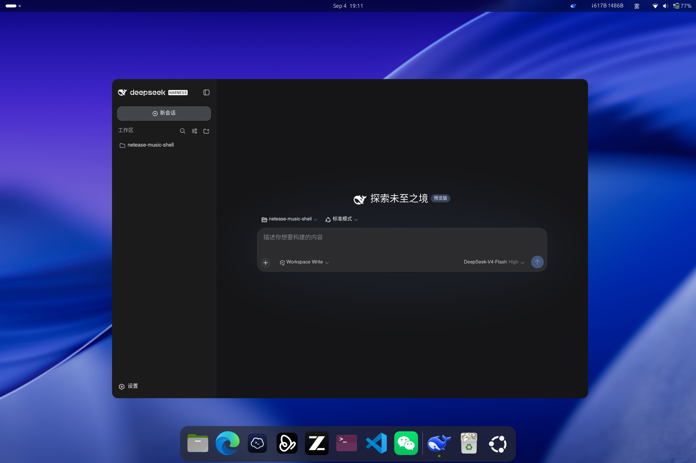

<div align="center">
  
  <h1>DeepSeek Harness Desktop</h1>
  <p>DeepSeek Harness · Linux 原生桌面客户端</p>

  <p>
    <a href="LICENSE"></a>
    <a href="https://github.com/Leon00x/deepseek-harness-desktop/releases/latest"></a>
    <a href="https://github.com/topics/dsh-plugin"></a>
  </p>
</div>

把 **DeepSeek Harness Web UI 变成 Linux 原生桌面应用**:独立窗口、系统托盘、沉浸式无边框模式,
保留登录状态与完整网页能力,开箱即用。

> 基于 [WebApp Launcher](https://github.com/Leon00x/webapp-launcher) 的定制版本。

## 界面预览

<!-- TODO: 补充截图后取消注释并替换文件
<p align="center">
  
</p>

| 桌面端主界面 | 沉浸模式与托盘 | 设置页 |
|---|---|---|
|  |  |  |
-->

截图请放入 [`docs/images/`](docs/images/) 后更新上方区块(推荐 `main.png` / `immersive.png` / `settings.png`)。

## 特性

- **开箱即用**:下载即运行,默认连接本机 `http://127.0.0.1:3080` 的 DeepSeek Harness;首次启动自动写入默认配置并直接进入桌面端
- 连接地址/名称/图标可在设置页修改(图标右键菜单、系统托盘或 `--config` 均可打开设置)
- 可选**沉浸模式**:无边框透明圆角窗口 + 顶部悬浮控制栏
- **Linux 原生体验**:桌面集成自动同步(应用名、图标、右键菜单)、可关闭系统托盘、Wayland/X11 均支持
- 独立 WebKit 数据目录,Harness 登录/会话状态持久保存

## 下载安装

前往 [Releases](https://github.com/Leon00x/deepseek-harness-desktop/releases/latest):

```bash
# Debian / Ubuntu
sudo apt install ./DeepSeekHarness_*_amd64.deb

# 其他发行版
chmod +x DeepSeekHarness_*_amd64.AppImage && ./DeepSeekHarness_*_amd64.AppImage
```

**使用前提**:本机(或可访问的机器)正在运行 DeepSeek Harness Web 服务;
默认地址 `http://127.0.0.1:3080`,不同端口可在设置页修改(运行 `deepseek-harness --config` 打开)。

## 从源码构建

```bash
# Ubuntu / Debian 依赖
sudo apt install -y libwebkit2gtk-4.1-dev libayatana-appindicator3-dev \
  build-essential curl wget file libxdo-dev libssl-dev librsvg2-dev pkg-config

npm ci
npm run dev          # 开发运行
npm run build        # 产物: src-tauri/target/release/bundle/{deb,appimage}/
```

## 项目结构

```text
src/                  # 设置页（纯 HTML/CSS/JS）
src-tauri/
├── capabilities/     # 远程页面最小窗口控制权限
├── icons/            # 应用图标（logo 派生）
└── src/
    ├── main.rs       # 入口 / 单实例 / 启动决策（无配置自动写默认值）
    ├── config.rs     # 配置模型与持久化
    ├── desktop.rs    # 桌面入口自动同步（名称/图标/右键菜单）
    ├── icons.rs      # favicon 探测 / 图片处理 / 缓存
    ├── tray.rs       # 可关闭的系统托盘
    ├── window.rs     # 窗口构建与注入脚本
    └── commands.rs   # 设置页 Tauri 命令
```

## 系统要求

- Linux x86_64 + WebKitGTK 4.1
- 沉浸模式需要支持透明窗口的合成器

实现细节与踩坑见 [docs/maintenance.md](docs/maintenance.md)。

## 许可证

[MIT](LICENSE)。DeepSeek Harness 及其网页内容权利归各自权利人所有。
